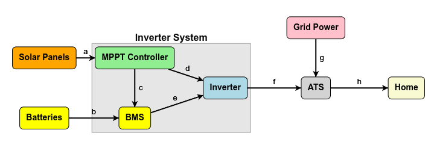

# Solar system

## 太阳能系统原理探讨

### Solar Panels

### MPPT Controller
原理、注意点。对于家用太阳能系统，肯定是需要MPPT的，不能用便宜的PWM系统。

### 充电
充电过程其实比较复杂，不是把线接上去就能充的。
- 充电的电流最好能比较稳定
- 需要对电池的充电情况进行调度。包括单个电池里面大量电芯的调度，以及多个电池之间通过RS485/CAN协议的协同调度。

所以需要一个BMS对其进行管理。

### 电流逆变 (DC => 50Hz AC)
这个其实是Inverter的原本意思。

### ATS
ATS用于切换（一般都是自动切换）入户用电。正常的做法都是by default用Solar System的，当Solar System（包括电池）的电耗光的时候，换用grid。当然，Invert有时候还有返充回电网的选择，不过电网给的电价太低，这方面实在不是太有价值。

美国电网的电，入户是单相三线电，把中性线当成0V的话，另外两根线分别是+/- 120V，所以我们ATS里面给出来电也需要是一样的标准。也就是说Inverter如果需要接入家庭电网的话，需要也是单相三线电。好一点的是，不需要确保相位同步，因为不需要同时向家庭电网供电。也有inverter做这个的，那就太贵了，没有必要。我们后面讨论一下我们怎么解决非同相对家用的问题。

非同相的话，有一个问题就是电路切换时候那个100ms掉电。对于我们大多数电器而言，掉个100ms电没什么太大问题。当然，我们也需要考虑下哪些设备不能忍受这种情况的。一般是服务器，还有带控制器的设备。带控制器的设备可以看看控制器能不能容忍掉电重启，不行的可能得考虑拍个小电池上去，用小电池供电，同时长期充电。服务器用电池可能不太行，虽然现在65W电池也不少，但是这么到处拍好像成本还挺高的，所以可能要考虑接个带UPS的电源。

### Inverter概念的泛用
目前Inverter其实是图上的Inverter System，甚至Hybrid / Grid-Tie Inverter把ATS功能也包括了。它的优缺点如下：

- 优点
- 缺点

## 实操思路

目前没看到特别合适的实操示意图。所以我只能讲一些从DIY+可扩展的角度，我觉得实际比较可行的路线。同时，我也会记录一下我看过的器材manual中，比较需要注意的电。

### 对于DIY而言，需要首先考虑的问题
#### 电网改线
这块是最难的，所以第一步需要能把这个做对，后续才有更多的扩展的可能。

ATS要选一个好的。入户线一般用的是100A的，2~3AWG的，挺粗的，所以我们ATS需要装在配电盘边上。这里具体的问题是，我没找到地方断开入户电源线，可能这个东西需要有资质的电工甚至电网过来改线。ATS装上了的话，我们可以先用Grid的电，然后慢慢来折腾Solar.

对了，ATS这里需要装好保险丝啥的传统电路保护的那些东西，那些不太擅长，回头得查一下。

还有一种方案是直接上一个强力的Inventer System，就是像前面那个图那样，同时还兼ATS功能的。好处是简单，坏处就是贵，而且后续不好扩展。你想，这么玩总得上个15kW这种级别的Inverter吧，要不以后万一不够了怎么办？然后我觉得inverter这东西不是啥高科技，价格总是会挺快下来的。

#### Solar Panel的触发功率问题
本来想买块板子，然后直接接到inverter上，看看跑起来怎么样的。后来查了下inverter specs才发现，它对input voltage是有要求的。譬如像[这个](https://www.portable-sun.com/collections/inverters/products/eg4-6000xp-off-grid-inverter-8000w-pv-input-6000w-output-480v-voc-input-48v-120-240v-split-phase-all-in-one-solar-inverter)，看它[manual](https://eg4electronics.com/wp-content/uploads/2024/04/EG4-6000XP-Manual.pdf)就可以发现，它接收太阳能板的范围在100V~480V，MPP有效工作在120V～385V之间，最优工作状态是320V。320V什么概念，我们一块400W板子大概是37V x 12A，也就是说要8块这样的板子串连，起码也需要4块板子才能启动。因为[板子](https://www.portable-sun.com/products/hyperion-400w-bifacial-solar-panel-black-up-to-500w-with-bifacial-gain/?gad_source=1&gclid=CjwKCAiA9vS6BhA9EiwAJpnXw4_F8R32Qgwqvkf90u5xYNBu4Qv3uvl2k-YHaTX-4v27fx1klHzQExoCXaQQAvD_BwE)并不太贵，像上面这个应该算挺好的，也就$105一块。所以这里主要需要考虑的是空间问题。

#### 装板子的问题
我可能一开始先跳过这个问题。我后院有个棚子，一开始装个4～8块应该还行，可以先用着。然后支架啥的我可能先用3d-print一些mount先用着。等了解一下这东西怎么接之后，再去买成品挂屋顶上。

#### 电池接线和配置
一开始用一个电池，5度电，应该可以先不管。后面要扩展的话，需要搞个rack。然后需要把RS485/CAN的线接上，然后把id配好。其实也不差，刚好把服务器也都放进去，不要用无线就好。

#### 电池安全性和设备安全性
是不是有什么靠谱的inspection service可以用？一开始要装些啥帮我们review，装好之后帮我们走流程确保安装没问题啥的？这方面我就还没调研了。
